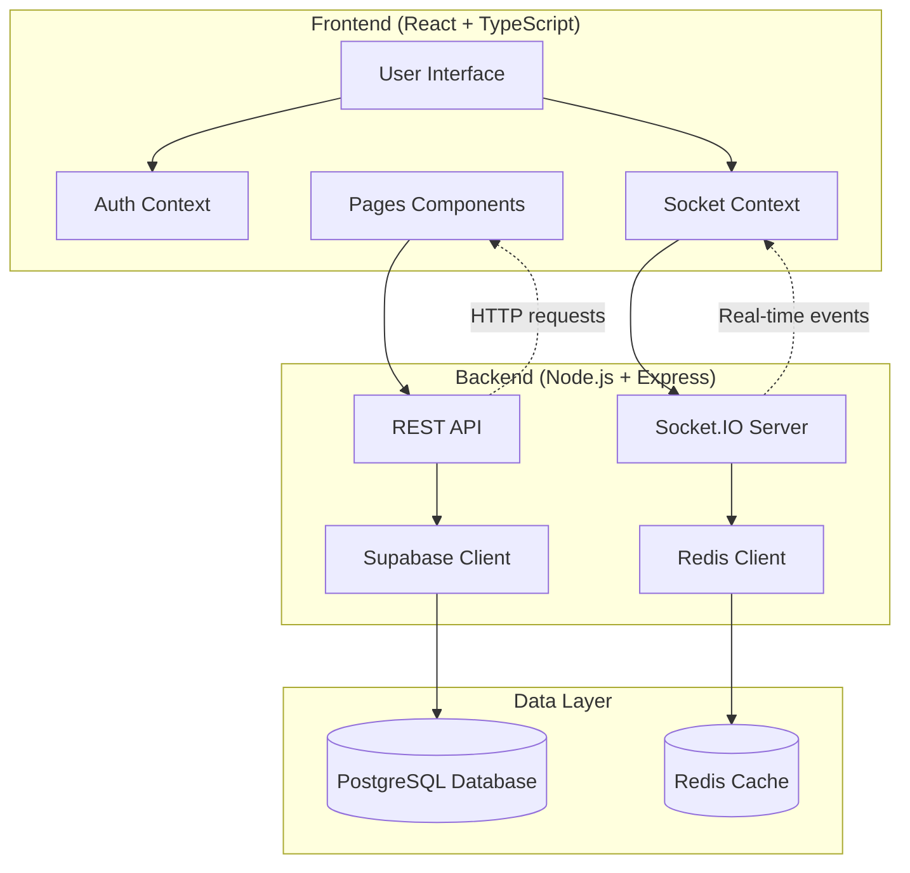
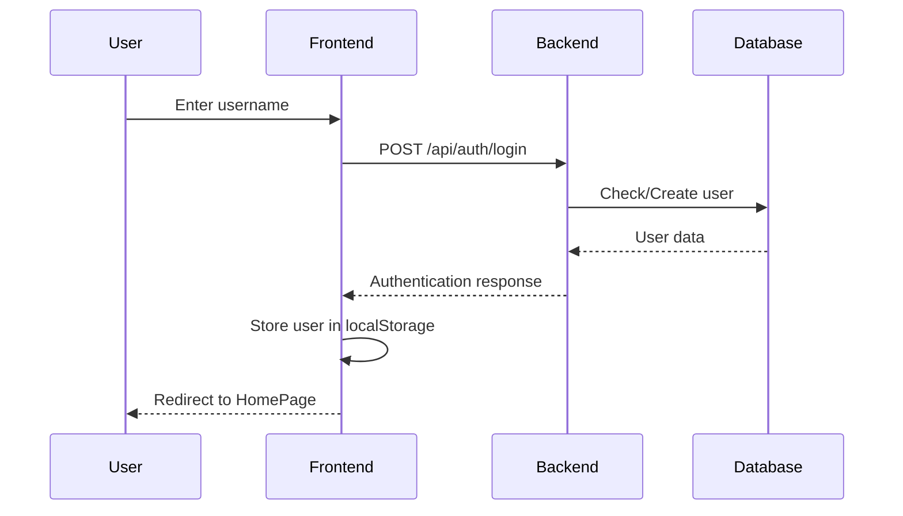
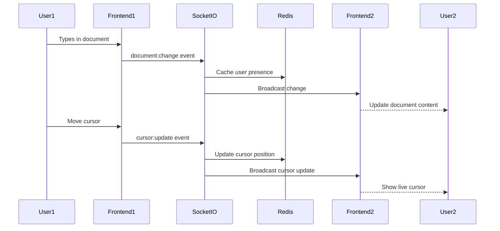
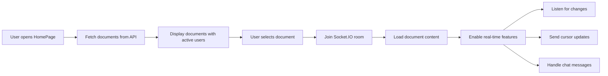

# Real-Time Collaborative Document Editor

A modern, full-stack collaborative document editing application that enables multiple users to simultaneously edit documents with real-time synchronization, live cursors, user presence tracking, and integrated chat functionality.

## 🚀 Features

- ✨ **Real-time collaborative editing** - Multiple users can edit documents simultaneously
- 👥 **Live user presence** - See who's currently active in each document  
- 🖱️ **Live cursor tracking** - View other users' cursor positions in real-time
- 💬 **Integrated chat** - Real-time messaging within document context
- 📄 **Document management** - Create, edit, and organize documents
- 🔄 **Auto-save functionality** - Changes are automatically saved
- 🎨 **Modern UI** - Clean, responsive design with glass morphism effects
- ⚡ **High performance** - Redis caching and optimized data structures

## 🏗️ Architecture Overview



## 📊 Application Flow

### User Authentication Flow


### Real-time Collaboration Flow


### Document Management Flow


## 🛠️ Technology Stack

### Frontend
- **React 19** - Modern React with latest features
- **TypeScript** - Type safety and better development experience
- **Vite** - Fast build tool and development server
- **Tailwind CSS** - Utility-first CSS framework
- **Socket.IO Client** - Real-time bidirectional communication
- **React Router DOM** - Client-side routing
- **Axios** - HTTP client for API requests

### Backend
- **Node.js** - JavaScript runtime
- **Express.js** - Web application framework
- **Socket.IO** - Real-time WebSocket communication
- **Redis** - In-memory data store for caching and presence
- **Supabase** - PostgreSQL database as a service
- **TypeScript** - Type safety on the backend

### Infrastructure
- **Railway** - Production deployment platform
- **Replit** - Development environment
- **PostgreSQL** - Primary database for persistent data
- **Redis** - Caching and real-time data store

## 📁 Project Structure

```
├── src/                          # Frontend source code
│   ├── contexts/                 # React Context providers
│   │   ├── AuthContext.tsx       # User authentication state
│   │   └── SocketContext.tsx     # Socket.IO connection management
│   ├── pages/                    # Application pages
│   │   ├── LoginPage.tsx         # User authentication interface
│   │   ├── HomePage.tsx          # Document list and management
│   │   └── DocumentPage.tsx      # Main collaborative editor
│   ├── App.tsx                   # Main application component
│   ├── main.tsx                  # Application entry point
│   └── index.css                 # Global styles
├── server/                       # Backend source code
│   ├── database/                 # Database schema and migrations
│   │   └── schema.sql            # PostgreSQL table definitions
│   ├── utils/                    # Utility functions
│   │   └── redis.js              # Redis client and operations
│   └── index.js                  # Main server application
├── public/                       # Static assets
├── package.json                  # Project dependencies and scripts
├── vite.config.ts               # Vite configuration
├── tailwind.config.js           # Tailwind CSS configuration
├── railway.json                 # Railway deployment configuration
└── README.md                    # Project documentation
```

## 🔧 Installation & Setup

### Prerequisites
- Node.js 18+ 
- npm or yarn
- Redis server
- Supabase account
- Railway account (for production deployment)

### Local Development Setup

1. **Clone the repository**
   ```bash
   git clone <repository-url>
   cd real-time-collaborative-document-editor
   ```

2. **Install dependencies**
   ```bash
   npm install
   ```

3. **Set up environment variables**
   Create a `.env` file in the root directory:
   ```env
   SUPABASE_URL=your_supabase_project_url
   SUPABASE_ANON_KEY=your_supabase_anon_key
   REDIS_URL=redis://127.0.0.1:6379
   NODE_ENV=development
   PORT=3001
   ```

4. **Set up the database**
   - Create a Supabase project
   - Run the SQL schema from `server/database/schema.sql`
   - Configure Row Level Security policies

5. **Start Redis server**
   ```bash
   redis-server --port 6379 --bind 127.0.0.1
   ```

6. **Run the application**
   ```bash
   npm run start
   ```

The application will be available at `http://localhost:5000`

## 🚀 Deployment

### Railway Deployment

1. **Connect your repository** to Railway
2. **Set environment variables** in Railway dashboard:
   - `SUPABASE_URL`
   - `SUPABASE_ANON_KEY` 
   - `REDIS_URL` (automatically provided by Railway Redis service)
   - `NODE_ENV=production`

3. **Add Redis service** in Railway
4. **Deploy** - Railway will automatically build and deploy your application

### Replit Development

1. **Import repository** to Replit
2. **Install dependencies** - automatically handled
3. **Set secrets** in Replit:
   - `SUPABASE_URL`
   - `SUPABASE_ANON_KEY`
4. **Run the application** - uses the configured workflow

## 🛠️ Development Problems & Solutions

### Problem 1: Redis Connection Issues
**Issue:** Redis failing to connect in production environment
```
Redis Client Error: connect ECONNREFUSED 127.0.0.1:6379
```

**Root Causes:**
- Incompatible RDB format version from previous Redis installations
- Incorrect host binding in cloud environments
- Missing Redis service in production

**Solutions Implemented:**
1. **Environment-specific Redis configuration**
   ```javascript
   const redisUrl = process.env.REDIS_URL || 'redis://127.0.0.1:6379';
   redisClient = createClient({ url: redisUrl });
   ```

2. **Graceful error handling**
   ```javascript
   redisClient.on('error', (err) => {
     console.log('⚠️ Redis connection failed:', error.message);
     console.log('🔄 Application will continue without Redis features');
     redisClient = null;
   });
   ```

3. **Clean Redis startup**
   ```bash
   # Remove incompatible dump file
   rm -f dump.rdb
   # Start with proper configuration
   redis-server --port 6379 --bind 127.0.0.1 --protected-mode no --daemonize yes
   ```

### Problem 2: Port Conflicts in Development
**Issue:** Multiple services trying to use the same ports
```
Error: listen EADDRINUSE: address already in use 0.0.0.0:3001
```

**Solutions:**
1. **Process cleanup before restart**
   ```bash
   pkill -f "node.*server/index.js"
   pkill -f redis-server
   ```

2. **Strict port configuration**
   ```typescript
   // vite.config.ts
   export default defineConfig({
     server: {
       port: 5000,
       strictPort: true, // Fail if port is in use
       host: '0.0.0.0'
     }
   });
   ```

### Problem 3: Cross-Origin Issues in Cloud Environments
**Issue:** Frontend unable to communicate with backend due to CORS and proxy issues

**Solutions:**
1. **Comprehensive CORS setup**
   ```javascript
   app.use(cors({
     origin: "*",
     methods: ["GET", "POST", "PUT", "DELETE"],
     credentials: true
   }));
   ```

2. **Vite proxy configuration**
   ```typescript
   server: {
     proxy: {
       '/api': {
         target: 'http://localhost:3001',
         changeOrigin: true,
       },
     },
   }
   ```

3. **Host configuration for cloud environments**
   ```typescript
   server: {
     host: '0.0.0.0', // Accept connections from any host
     allowedHosts: true // Allow iframe embedding
   }
   ```

### Problem 4: Username Display Truncation
**Issue:** Long usernames being cut off in the UI

**Solution:**
```tsx
// Before: Fixed width causing truncation
<span className="text-xs bg-gradient-to-r from-indigo-500 to-purple-600 text-white px-3 py-1 rounded-full font-medium">
  {user.username}
</span>

// After: Flexible width with proper spacing
<span className="text-xs bg-gradient-to-r from-indigo-500 to-purple-600 text-white px-3 py-1 rounded-full font-medium whitespace-nowrap max-w-none">
  {user.username}
</span>
```

### Problem 5: Real-time Synchronization Issues
**Issue:** Race conditions and state inconsistencies in collaborative editing

**Solutions:**
1. **Optimistic updates with server reconciliation**
2. **Document versioning and conflict resolution**
3. **Redis-based state synchronization**
4. **Proper Socket.IO room management**

## 🎯 Key Implementation Details

### Real-time Cursor Tracking
```javascript
// Calculate precise cursor position
const lines = content.substring(0, cursor.position || 0).split('\n');
const lineNumber = lines.length - 1;
const columnNumber = lines[lines.length - 1]?.length || 0;

const computedStyle = window.getComputedStyle(textarea);
const lineHeight = parseFloat(computedStyle.lineHeight) || 27;
const charWidth = fontSize * 0.6;

const top = lineNumber * lineHeight + 4;
const left = columnNumber * charWidth + 2;
```

### User Presence Management
```javascript
// Redis-based presence tracking
export const addUserToDocument = async (documentId, userId, username) => {
  const presenceKey = `doc:${documentId}:presence`;
  await redisClient.sAdd(presenceKey, userId);
  await redisClient.expire(presenceKey, 300); // 5 minutes TTL
  
  const userKey = `user:${userId}:info`;
  await redisClient.hSet(userKey, {
    id: userId,
    username: username,
    lastSeen: Date.now()
  });
  await redisClient.expire(userKey, 300);
};
```

### Document Caching Strategy
```javascript
// Multi-layer caching approach
const getCachedDocument = async (documentId) => {
  const cacheKey = `doc:${documentId}:cache`;
  const cached = await redisClient.get(cacheKey);
  if (cached && (Date.now() - JSON.parse(cached).cachedAt < 300000)) {
    return JSON.parse(cached); // Return cached version
  }
  
  // Fetch from database and cache
  const document = await fetchFromDatabase(documentId);
  await cacheDocument(documentId, document);
  return document;
};
```

## 🔍 Performance Optimizations

1. **Redis Caching**
   - Document content caching (5-minute TTL)
   - User presence tracking with automatic cleanup
   - Cursor position caching (1-minute TTL)

2. **Database Optimization**
   - Proper indexing on frequently queried columns
   - Connection pooling via Supabase
   - Minimal database calls with smart caching

3. **Frontend Optimization**
   - React Context for efficient state management
   - Optimized re-rendering with proper dependency arrays
   - Debounced API calls for search and updates

4. **Real-time Optimization**
   - Socket.IO rooms for targeted message broadcasting
   - Efficient cursor position calculations
   - Automatic cleanup of inactive connections

## 🧪 Testing

### Manual Testing Checklist
- [ ] User authentication (login/logout)
- [ ] Document creation and editing
- [ ] Real-time collaboration with multiple users
- [ ] Live cursor tracking
- [ ] Chat functionality
- [ ] User presence indicators
- [ ] Auto-save functionality
- [ ] Connection recovery after network issues

### Performance Testing
- [ ] Multiple concurrent users (10+ users)
- [ ] Large document editing (10k+ characters)
- [ ] Network latency simulation
- [ ] Memory usage monitoring
- [ ] Redis performance under load

## 🤝 Contributing

1. Fork the repository
2. Create a feature branch (`git checkout -b feature/AmazingFeature`)
3. Commit your changes (`git commit -m 'Add some AmazingFeature'`)
4. Push to the branch (`git push origin feature/AmazingFeature`)
5. Open a Pull Request


## 🙏 Acknowledgments

- Socket.IO for excellent real-time communication
- Supabase for seamless database management
- Railway for reliable deployment platform
- Tailwind CSS for beautiful, responsive design
- React and TypeScript communities for amazing tools


